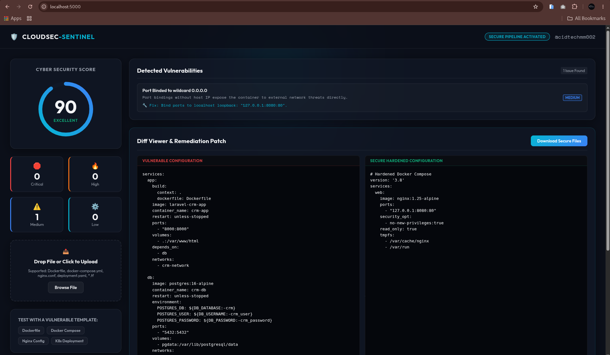
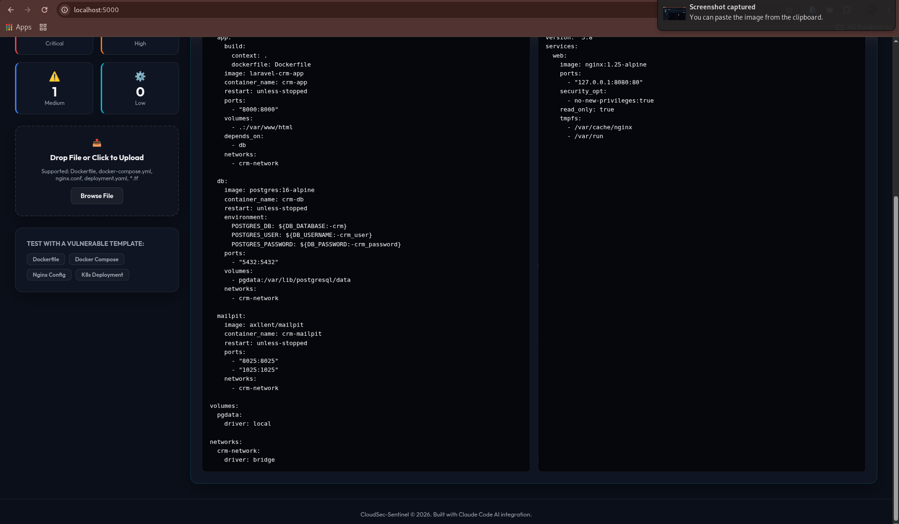

# 🛡️ CloudSec-Sentinel

> **Automated Cloud & Local Infrastructure Compliance, Security Linter & Remediation Engine.**

CloudSec-Sentinel is a DevSecOps auditing tool designed to scan configuration files (Docker, Docker Compose, Kubernetes, and Nginx) for security vulnerabilities, compliance drift, and hardcoded threats. It generates high-fidelity compliance scores, vulnerability logs, and automated bash/configuration patching scripts.




## 🌟 Key Features

- **Multi-Vector Auditing**: Scans `Dockerfile`, `docker-compose.yml`, `nginx.conf`, and Kubernetes `deployment.yaml` configurations.
- **CIS Benchmarks & OWASP Top 10 Compliance**: Evaluates your configuration code against core industry standards.
- **Interactive Security Score Card**: Displays a dynamic circular gauge score representing your repository's security posture.
- **Autopilot Remediation (Code Diff)**: Shows side-by-side comparisons of the vulnerable and hardened versions with a single-click patch download.
- **AI-Powered Threat-Hunting Subagent**: Powered by Claude Code configurations containing custom compliance rules and automated patch generation engines.

## 🛠️ Tech Stack & Integrations

- **Frontend**: Vanilla HTML5, CSS3 (Glassmorphism design system), Vanilla JS.
- **AI Engine (Claude Code integration)**:
  - **Model Context Protocol (MCP)**: Connected via Filesystem MCP (to scan workspaces) and Brave Search MCP (to search CVE databases).
  - **Custom Security Skill**: `cloudsec-auditor` (rules matching CIS benchmarks and Docker/K8s security standards).
  - **Remediation Agent**: `cloudsec-patcher` (subagent generating hardened configuration edits and idempotency patching scripts).

## 🚀 Getting Started

### 1. Run the Web Dashboard
You can host the dashboard using any simple local static file server. For example:

```bash
# Using python
python3 -m http.server 8080
```
Then, open `http://localhost:8080` in your web browser.

### 2. Configure Claude Code Security Agent
To enable the CloudSec-Sentinel auditing and patching subagent, place the following configurations into your workspace directory:

- Ensure `.mcp.json` is at the root of your project.
- Place `.claude/skills/cloudsec-auditor/SKILL.md` to load the compliance rules.
- Place `.claude/agents/cloudsec-patcher.md` to load the remediation agent configuration.

Then, you can run audits directly inside Claude Code:
```bash
claude -p "Audit my current directory using cloudsec-auditor skill and save report"
```

## 📝 License
MIT License.
